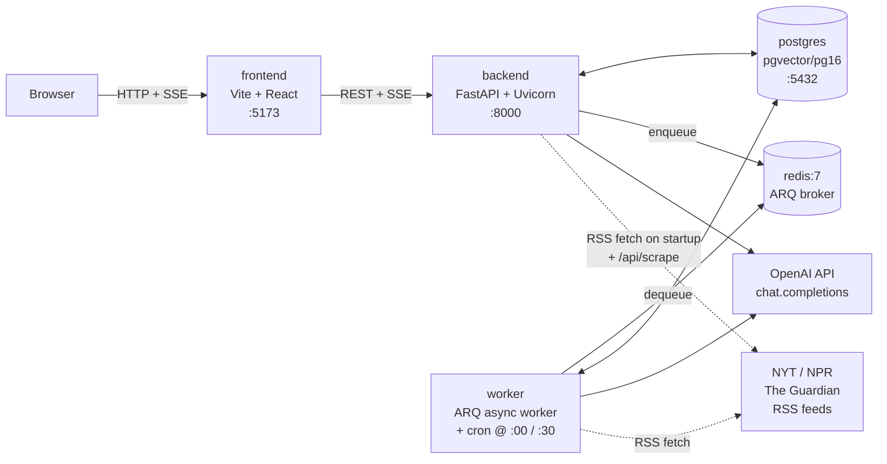
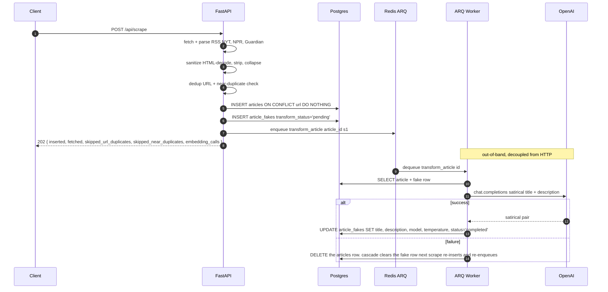
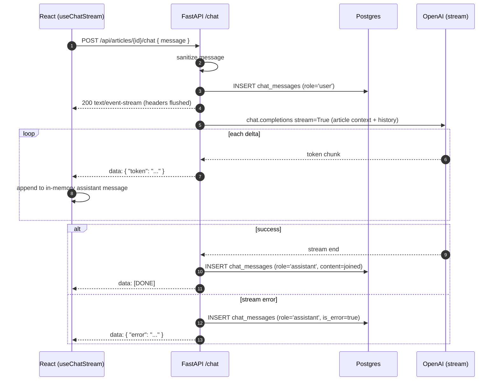
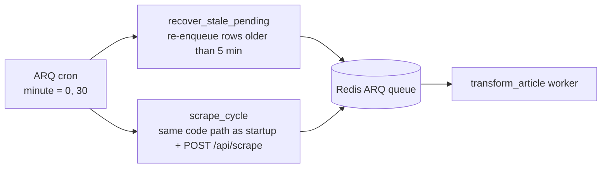
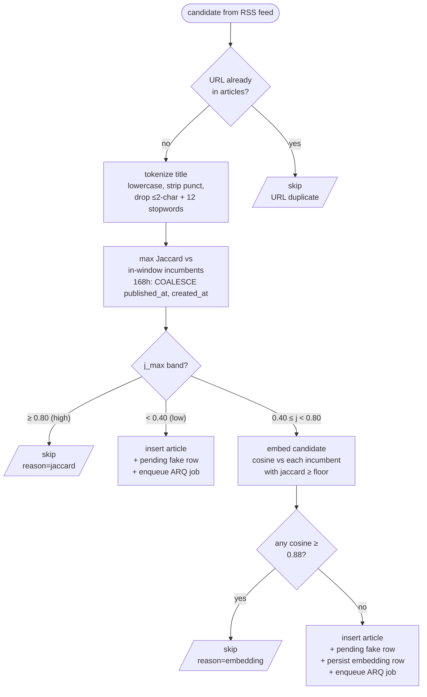
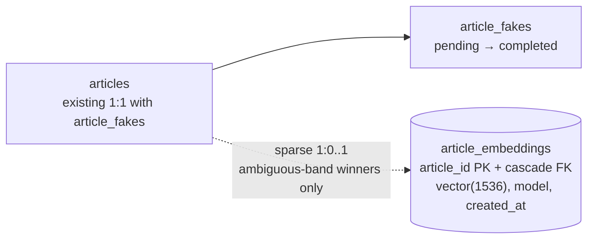

# Fake News Generator

[](https://github.com/bitsa/fake-news-generat0r/actions/workflows/backend-ci.yml)
[](https://github.com/bitsa/fake-news-generat0r/actions/workflows/frontend-ci.yml)
[](https://github.com/bitsa/fake-news-generat0r/actions/workflows/integration-ci.yml)
[](https://coderabbit.ai)

A take-home implementation of the
[Fake News Generator brief](./plans/assignment.md). The app scrapes
RSS feeds from NYT, NPR, and The Guardian, transforms each article into a
satirical version with OpenAI on a background worker, exposes a news-feed UI
with original/fake toggle and source filtering, and provides a per-article
streaming chat panel backed by Server-Sent Events.

Stack: **FastAPI + ARQ + Postgres (pgvector) + Redis** on the backend,
**Vite + React + React Query + Tailwind** on the frontend, all wired up via
**Docker Compose**.


---

## Table of contents

1. [Quick start](#quick-start)
2. [System architecture](#system-architecture)
3. [Assignment deliverables](#assignment-deliverables)
   - [1. RSS scraper + transform pipeline](#1-rss-scraper--transform-pipeline)
   - [2. News website UI](#2-news-website-ui)
   - [3. Chat interface (streaming)](#3-chat-interface-streaming)
   - [4. Periodic scraping (bonus)](#4-periodic-scraping-bonus)
   - [5. Near-duplicate detection (bonus)](#5-near-duplicate-detection-bonus)
4. [Evaluation-criteria mapping](#evaluation-criteria-mapping)
5. [Beyond the brief](#beyond-the-brief)
6. [Local dev workflow](#local-dev-workflow)
7. [Project layout](#project-layout)
8. [Doc structure](#doc-structure)

---

## Quick start

```bash
git clone https://github.com/bitsa/fake-news-generat0r.git
cd fake-news-generat0r
cp .env.example .env
# Edit .env and replace OPENAI_API_KEY=sk-REPLACE_ME with a real key
docker compose up --build
```

Once up:

- Backend: <http://localhost:8000>
- Frontend: <http://localhost:5173>
- Health: <http://localhost:8000/health>

The stack uses Docker Compose v2 (`docker compose`, with a space). The legacy
v1 `docker-compose` CLI is not supported.

`OPENAI_API_KEY` is the only variable that must be replaced before running;
the rest have working defaults. All variables are documented in
[`.env.example`](./.env.example).

To tear down and **drop the Postgres volume**:

```bash
docker compose down -v
```

---

## System architecture

Five containers managed by Docker Compose. The API and worker share a single
codebase; they differ only by entrypoint (`uvicorn` vs `arq`).



**Why this shape:** the API stays fast and predictable by never blocking on
LLM calls — it only enqueues work. The worker isolates long-running OpenAI
traffic from request handlers. Postgres is the source of truth; Redis is a
fast-path delivery mechanism, not a system of record.

Architectural rationale (Python over Node, ARQ over Celery, SSE over
WebSockets, hand-written migrations, etc.) lives in [`context.md`](./context.md).

---

## Assignment deliverables

### 1. RSS scraper + transform pipeline

Parses three RSS feeds, sanitizes the text, deduplicates by URL, persists to
Postgres, and asynchronously transforms each new article into a satirical
version with OpenAI. The HTTP request returns immediately after the DB
inserts; the LLM call happens out-of-band on the worker.

#### API

| Method | Path | Behavior |
|---|---|---|
| `POST` | `/api/scrape` | Fetch all feeds, dedup, insert new articles, enqueue transforms. Returns `{ inserted, fetched, skipped_url_duplicates, skipped_near_duplicates, embedding_calls }` with `202`. |
| `GET` | `/api/articles` | Returns the full feed (originals + fakes joined). |

#### Flow



**Durability model.** `article_fakes.transform_status` has only two states:
`pending` and `completed`. On transform failure the **parent `articles` row
is deleted** — `ON DELETE CASCADE` clears the `article_fakes` row (and any
`chat_messages`, though none exist for an unfinished article since the feed
and chat both gate on `completed`). The next scrape cycle finds no URL
conflict, re-inserts the article, and `create_and_enqueue` produces a fresh
`pending` row + enqueue. No `failed` state, no `transform_error` column, no
attempts counter, no retry storms — at most one retry per scrape cycle (every
30 min). If instead the queue is wiped or the worker crashes mid-flight before
the `except` block runs, the `pending` row survives and the next cron tick
re-enqueues anything older than 5 minutes via
[`recover_stale_pending`](./backend/app/services/transformer.py). Redis is
an optimisation, not the record of intent. Full reasoning in
[`context.md`](./context.md#transform-durability-model).

### 2. News website UI

Two React surfaces backed by React Query. All server state goes through
`@tanstack/react-query` — no `useState` for server data, no global store.

- **Feed page** — list of fake articles (title + snippet + source + date),
  source filter chips, refresh button, pending/empty/error states.
- **Article detail** — full satirical version with a toggle to show the
  original side-by-side, plus the embedded chat panel for that article.


The source filter lives in URL query params, not component state, so the
view survives refresh and is shareable. Articles are persisted in
Postgres — refreshing the page or restarting the stack yields the same feed.

### 3. Chat interface (streaming)

Per-article chat with token-by-token streaming via Server-Sent Events.
Implemented manually (no Vercel AI SDK) using
[`@microsoft/fetch-event-source`](https://www.npmjs.com/package/@microsoft/fetch-event-source)
on the client and FastAPI's `StreamingResponse` on the server.

#### API

| Method | Path | Behavior |
|---|---|---|
| `GET` | `/api/articles/{id}/chat` | Full chat history, ordered. |
| `POST` | `/api/articles/{id}/chat` | Persist user msg, stream assistant tokens, persist assistant msg on completion. SSE `text/event-stream`. |

#### Flow



**Why SSE.** The pattern is unidirectional (server → client only). SSE is
plain HTTP — no upgrade handshake, no persistent connection state to
manage server-side. WebSockets would have added reconnect protocol code
for zero functional benefit on a one-way stream.

**Why one row per chat message.** `chat_messages` is one row per turn with
a `role` column (`'user' | 'assistant'`). Conversations reconstruct by
ordering on `created_at`. A JSON-blob alternative would have lost
queryability and the future `user_id` extension path.

### 4. Periodic scraping (bonus)

Scheduled scraping runs as an ARQ cron job inside the existing `worker`
container, firing at wall-clock `:00` and `:30` of every hour. The cron
handler reuses `scraper.scrape_cycle` — the same helper invoked from the
FastAPI startup lifespan — so startup and periodic scrapes share one code
path.



We chose ARQ cron over external schedulers (host cron, K8s CronJob,
GitHub Actions, separate scheduler container) because ARQ + Redis is
already in the stack, the worker process already runs continuously, and
ARQ's native cron support adds zero new dependencies.

### 5. Near-duplicate detection (bonus)

The brief asks (under *Bonus*): *"Article similarity detection (avoid
scraping near-duplicates from different sources)."* Today the URL gate
already drops exact-URL reposts via `ON CONFLICT (url)`, but the same
wire piece syndicated under different URLs across NYT / NPR / Guardian
sails through. That wastes a row in `articles`, a row in `article_fakes`,
an ARQ job, and an OpenAI transform call per duplicate. The dedup feature
closes that gap with a hybrid **title-Jaccard → embedding-cosine** pipeline
that keeps embedding spend sparse: most candidates are decided by the cheap
Jaccard pass, and only an ambiguous middle band escalates to a vector call.

#### Flow



#### What lands in the database



`article_embeddings` is **sparse on purpose**: most articles never enter
the ambiguous Jaccard band, so most rows in `articles` have no sibling
embedding. Cold incumbents that *do* get embedded during the cosine pass
have their vector persisted too — the decision documented in
[`docs/dedup/dedup-spec.md`](./docs/dedup/dedup-spec.md) is that the
first ambiguous-band hit may legitimately produce `embedding_calls = 2`
(candidate + cold incumbent), and persistence makes that a one-time cost.

#### Why hybrid (Jaccard then embedding)

A pure cosine pipeline would call OpenAI per candidate per incumbent —
fine on a slide, expensive in steady state. A pure Jaccard pipeline
misses paraphrased headlines about the same wire piece. The hybrid keeps
the cheap Jaccard as the dominant decider and only pays for an embedding
when the Jaccard score is genuinely ambiguous (`0.40 ≤ j < 0.80`), which
is rare on real RSS traffic. The **dollar win is not the embedding fee
itself but the avoided downstream transform call** on the satirical
rewrite — embeddings are roughly two orders of magnitude cheaper than
chat completions.

#### Operator visibility

`POST /api/scrape` returns four new counters alongside `inserted` /
`fetched`:

```json
{
  "inserted": 7,
  "fetched": 30,
  "skipped_url_duplicates": 14,
  "skipped_near_duplicates": 9,
  "embedding_calls": 2
}
```

On a steady-state scrape against a mostly-stable feed the operator sees
high skip counts and a low — often zero — embedding-call count. Each
near-duplicate skip also emits one `info` log line carrying `reason`
(`jaccard` or `embedding`) and the `matched_article_id` of the incumbent
that triggered it.

#### Tunables

All thresholds are env-overridable Pydantic Settings (defaults locked in
[`docs/dedup/dedup-spec.md`](./docs/dedup/dedup-spec.md)):

| Setting | Default | Effect |
|---|---|---|
| `DEDUP_WINDOW_HOURS` | `168` (7 days) | Comparison window for incumbents. |
| `DEDUP_JACCARD_HIGH` | `0.80` | Cheap-path skip threshold. |
| `DEDUP_JACCARD_FLOOR` | `0.40` | Below this, insert without embedding. |
| `DEDUP_COSINE_THRESHOLD` | `0.88` | Embedding-cosine match threshold. |
| `OPENAI_MODEL_EMBEDDING` | `text-embedding-3-small` | Embedding model. |

Source files:
[`backend/app/services/dedup.py`](./backend/app/services/dedup.py),
[`backend/app/services/embedding.py`](./backend/app/services/embedding.py),
integration into the scrape pipeline at
[`backend/app/services/scraper.py`](./backend/app/services/scraper.py).

---

## Evaluation-criteria mapping

The brief lists eight evaluation dimensions; this is where each one lives
in the codebase.

| # | Dimension | Where it lives |
|---|---|---|
| 1 | **DB schema design** | [`backend/app/models.py`](./backend/app/models.py), [`backend/migrations/`](./backend/migrations/). 1:1 `articles` ↔ `article_fakes` with `article_id` as both PK and FK. `chat_messages` one-row-per-turn with role check constraint and `(article_id, created_at)` index. Source identity is a Python `StrEnum` mirrored as a Postgres enum type — no `sources` table, drift impossible by construction. |
| 2 | **API design** | [`backend/app/routers/`](./backend/app/routers/). REST for CRUD, SSE for chat streaming. Endpoints: `POST /api/scrape`, `GET /api/articles`, `GET/POST /api/articles/{id}/chat`, `GET /health`. |
| 3 | **Async pipeline** | [`backend/app/services/scraper.py`](./backend/app/services/scraper.py) → [`transformer.py`](./backend/app/services/transformer.py) → [`workers/transform.py`](./backend/app/workers/transform.py). Synchronous DB write + best-effort enqueue, then out-of-band LLM call. Durability via DB-as-source-of-truth + cron-driven recovery. |
| 4 | **LLM integration** | [`services/openai_transform.py`](./backend/app/services/openai_transform.py) for the satirical transform; [`services/chat_llm.py`](./backend/app/services/chat_llm.py) for streaming chat. Both isolated behind service functions with mocks in tests. Sanitize-on-ingest reused for chat input. |
| 5 | **Frontend component structure** | [`frontend/src/pages/`](./frontend/src/pages/) (Feed, ArticleDetail) + [`components/`](./frontend/src/components/) (presentation) + [`hooks/`](./frontend/src/hooks/) (`useArticles`, `useChatHistory`, `useChatStream`, `useRefreshFeed`). React Query for server state, URL params for filter state, no global store. |
| 6 | **Error handling** | Custom `AppError` hierarchy in [`exceptions.py`](./backend/app/exceptions.py) with FastAPI exception handler → typed JSON errors. Transform failures delete the fake row (no zombie state). Chat stream failures persist an error sentinel + emit an SSE error frame. Frontend renders explicit `FeedError` / `FeedEmpty` / `FeedSkeleton` components, never silent loading. |
| 7 | **Code organization** | Routers → schemas → services → workers separation; API never imports a worker, worker never imports a router. Migrations are hand-written. Conventions enforced by `ruff` + `black` + `eslint` + `tsc --noEmit` in CI. |
| 8 | **AI-assisted development** | Spec-driven workflow: every task has `{task}-spec.md` (acceptance criteria) → `{task}-dev.md` (implementation plan) → `{task}-qa.md` (verification) under [`docs/`](./docs/). Tracker at [`tracker.md`](./tracker.md). Rationale at [`context.md`](./context.md). Loom talking track in [`future_work.md`](./future_work.md). |

---

## Beyond the brief

Things the brief did not ask for, included anyway because they materially
affect quality or demoability:

- **Spec-driven workflow.** Every non-trivial task has spec / dev / qa
  markdown under [`docs/`](./docs/), and a row in
  [`tracker.md`](./tracker.md). Lets a reviewer see *what* was built,
  *how* it was planned, and *how it was verified* without reading code.
- **Three-pipeline CI.** Separate
  [`backend-ci`](./.github/workflows/backend-ci.yml),
  [`frontend-ci`](./.github/workflows/frontend-ci.yml), and
  [`integration-ci`](./.github/workflows/integration-ci.yml) workflows.
  Backend runs ruff/black/pytest, frontend runs eslint/tsc/vitest,
  integration spins up the full stack in Docker and probes endpoints.
- **Transform durability model.** Two-state `pending`/`completed` plus
  cron-driven `recover_stale_pending`. Survives Redis wipes and worker
  crashes without retry storms.
- **ARQ cron periodic scrape** at HH:00 and HH:30, reusing the startup
  scrape code path.
- **Sanitize-on-ingest.** HTML-decode, tag-strip, whitespace-collapse for
  RSS-sourced text and chat input. Same helper for both surfaces.
- **AI guardrails spec.** Prompt-injection envelope, Moderation pre-check,
  refusal handling — fully specced under
  [`docs/ai-guardrails/`](./docs/ai-guardrails/), implementation deferred.
  Surfaces in `future_work.md`.
- **pgvector from day one.** Image is `pgvector/pgvector:pg16`, which
  let the dedup feature ship without a container rebuild — see
  [§ 5. Near-duplicate detection](#5-near-duplicate-detection-bonus)
  above and [`docs/dedup/`](./docs/dedup/).
- **Deterministic source enum.** No `sources` table — Python `StrEnum`
  mirrored as a Postgres enum type via Alembic. Adding a source is one
  enum line + one feed URL + a one-line `ALTER TYPE` migration.
- **Hand-written Alembic migrations.** Autogenerate misses complex
  constraints and produces unreadable diffs.
- **Makefile DX wrapper.** `make up`, `make backend-test`, `make health`,
  `make backend-alembic ARGS="current"`, etc. — see `make help`.
- **Markdown linting.** `markdownlint-cli2` over all docs, enforced via
  `make docs-lint`.
- **Frontend unit tests** with Vitest + React Testing Library
  ([`frontend/src/test/`](./frontend/src/test/)).

---

## Local dev workflow

Common operations are wrapped in the repo-root [`Makefile`](./Makefile).
Run `make help` for the full list. Highlights:

| Target | Effect |
|---|---|
| `make up` / `make up-d` / `make down` | Bring the stack up (foreground / detached) and down (keeps volumes). |
| `make down-clean` | `down -v`. Drops the Postgres volume. Destructive — prints a 3-second warning. |
| `make health` | `curl localhost:8000/health` smoke check. |
| `make backend-test` | `pytest` inside the backend container. |
| `make backend-lint` / `make backend-format` | ruff + black inside the backend container. |
| `make backend-alembic ARGS="current"` | Run Alembic subcommands inside the backend container. |
| `make frontend-typecheck` | `tsc --noEmit` inside the frontend container. |
| `make sync` / `make lock` | Manage the host-side `backend/.venv` from `backend/uv.lock` (IDE autocomplete). |
| `make docs-lint` / `make docs-fix` | `markdownlint-cli2` over all project markdown. |

---

## Project layout

```text
fake-news-generat0r/
├── backend/
│   └── app/
│       ├── routers/        # FastAPI route handlers (thin, no logic)
│       ├── schemas/        # Pydantic request/response models
│       ├── services/       # Business logic: scraper, transformer, chat, openai_*
│       ├── workers/        # ARQ worker entrypoint + cron registration
│       ├── models.py       # SQLAlchemy ORM
│       ├── main.py         # FastAPI app + lifespan (migrations, startup scrape)
│       └── ...
├── frontend/
│   └── src/
│       ├── pages/          # FeedPage, ArticleDetailPage
│       ├── components/     # Presentational components
│       ├── hooks/          # useArticles, useChatStream, useChatHistory, ...
│       ├── api/            # API client + types
│       └── ...
├── docs/                   # Per-task spec / dev / qa docs (see "Doc structure")
├── plans/                  # Project brief, iteration outlines, prompts
├── .github/workflows/      # backend-ci, frontend-ci, integration-ci
├── docker-compose.yml      # postgres, redis, backend, worker, frontend
├── Makefile                # DX wrapper
├── context.md              # Architectural decisions + standards
├── future_work.md          # Conscious deferrals (Loom talking points)
├── tracker.md              # Per-task status across iterations
└── README.md               # this file
```

---

## Doc structure

The canonical shared docs at the repo root — read before writing any code:

- [`context.md`](./context.md) — stack decisions, architectural rationale,
  coding standards
- [`future_work.md`](./future_work.md) — explicit deferrals (Loom talking
  points)
- [`tracker.md`](./tracker.md) — every task across iterations 0–3

Per-task documentation lives under `docs/`, with up to three files per task.
Naming is lenient — the prefix can be a task id (`1.3-spec.md`) or a feature
slug (`rss-scraper-spec.md`), whichever reads better for the task:

- `{task}-spec.md` — what to build (acceptance criteria)
- `{task}-dev.md` — how to build it (implementation plan)
- `{task}-qa.md` — how to verify it (test plan)

These three docs are produced and consumed by a set of project-local Claude
Code skills under [`.claude/skills/`](./.claude/skills/) that drive the
spec → dev → qa loop:

| Skill | Stage | What it does |
|---|---|---|
| `/write-spec {task}` | spec | Drafts `{task}-spec.md` from a rough idea + scope notes — pure acceptance criteria, no implementation. |
| `/write-dev {task}` | dev plan | Reads the verified spec and drafts `{task}-dev.md` (implementation plan, file-level). No code, no branch. |
| `/start-dev {task}` | dev exec | Reads the dev doc, surfaces open questions, branches `feature/{task}-{slug}` from `main`, and implements. |
| `/write-qa {task}` | qa plan | Black-box audit — maps each spec acceptance criterion to the unit tests dev wrote, flags gaps. Never reads the dev doc. |
| `/start-qa {task}` | qa exec | Runs the tests, audits coverage against the qa doc, files issues, sets the tracker to `done` or `blocked`. |

The intended workflow:

1. Sketch a rough idea and scope it.
2. `/write-spec` — produces `-spec.md`. Review and amend.
3. `/write-dev` — produces `-dev.md`. Review and amend.
4. `/start-dev` — branches and implements.
5. `/write-qa` — produces `-qa.md` (coverage audit only).
6. `/start-qa` — runs tests, files issues, marks done.

`plans/` holds the project brief, per-iteration outlines, and session
prompts.
